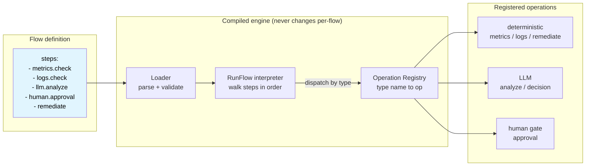
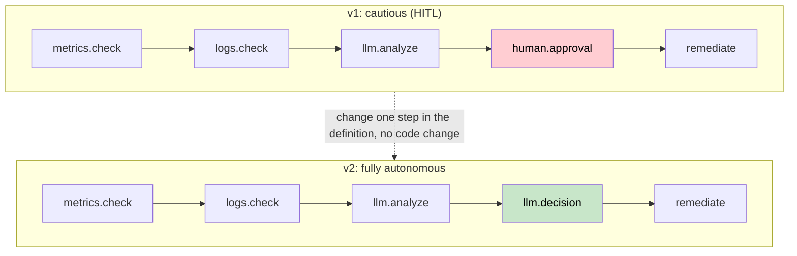
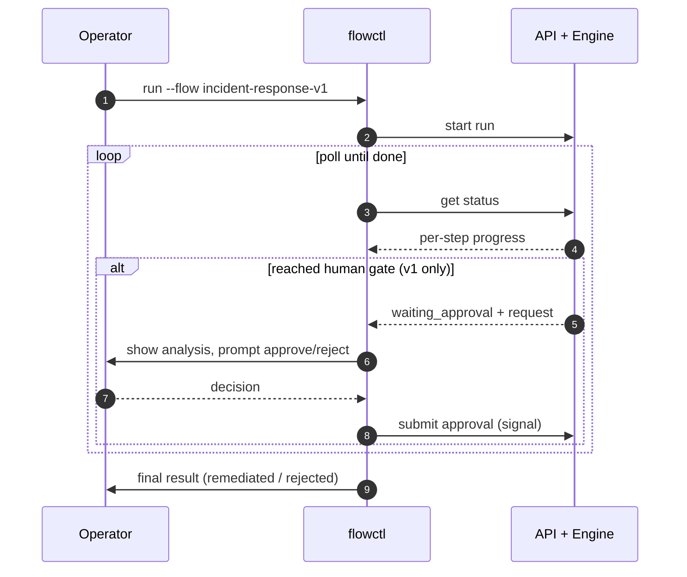

# Composable Operations

A workflow engine where the **workflow lives in configuration, not code**. A business process is written as a chain of operations in an external definition; a single generic engine interprets and runs it. Reshaping the flow is a config edit, not a code change or redeploy.

> Setup, environment variables, providers, and how to extend the engine live in **[docs/configuration.md](docs/configuration.md)**. This README stays focused on what the project demonstrates.

## Principles

1. **Externally-defined workflows drive the code.** The engine has no hard-coded pipeline. It reads a flow definition and executes whatever steps it declares, in order. Add, remove, reorder, or reconfigure steps by editing the definition alone: no code change, no redeploy. (The definition is YAML on disk here; it could equally be a database row or a config service.)
2. **Autonomy is a per-step choice, flipped in one edit.** The same pipeline can gate a decision behind a human approval or hand that decision to an LLM. Switching between the two is a single-step definition change, with no code touched and no downstream step affected.
3. **The platform provides capability, not policy.** The engine owns the *mechanism*: a library of operations (deterministic steps, LLM steps, human gates) and a durable runtime to sequence them. It does not own the *intent*. Which steps run, in what order, and how much of the process is automated versus kept under human control is entirely the client's to define. The platform hands over a toolbox and a runtime; the client decides what workflow to build and how autonomous it should be.

Everything below shows *how* these principles hold.

---

## Principle 1: Externally-defined workflows drive the code

There is one compiled workflow (`RunFlow`) that acts as an **interpreter**. It doesn't know what "incident response" is. It knows how to walk a list of steps, and for each step, look up an operation by its `type` name in a registry and run it. The definition is the program; `RunFlow` is the machine that runs it.

> **The YAML file is incidental.** This demo keeps flow definitions in YAML on disk purely because it's the simplest thing to read and edit. The definition could just as well live in a database, a config service, an admin UI, or any other external store. The engine only needs a list of steps handed to it at run start. What matters is the principle: **the steps of the workflow, and what each step does, live outside the compiled code.** That's what makes a flow editable without touching or redeploying the engine. Swapping YAML-on-disk for a database is a change to one component (the Loader), not to the engine, the ops, or the workflow model.



**The boundary that makes "no code changes" true:**

| To change... | You edit... |
|---|---|
| Which steps run, their order, their params, or a human↔LLM swap | **The flow definition** (the YAML file here; a DB row or config service in production) |
| Add a brand-new *capability* (an op type that doesn't exist yet) | **Go** (one file + register it) |

Composition is data. Capability is code. The demo never needs new capability, so the whole demonstration is a definition edit.

---

## Principle 2: Autonomy is a per-step choice, flipped in one edit

Two flows ship with the demo. They are the **same five-step pipeline**. Only the fourth step differs: v1 pauses for a human to approve remediation; v2 lets an LLM make that call. Because a `human.approval` step and an `llm.decision` step emit the **same decision output** (`{approved, comment, by}`), the downstream `remediate` step can't tell them apart.



That arrow is the entire diff between the two flow files:

```diff
-  - id: human-review
-    type: human.approval
-    params:
-      prompt: "Review the analysis and approve or reject scaling pgbouncer to 6 replicas."
-      display_fields: [service, pgbouncer_pool_size, pgbouncer_active_connections, analysis]
+  - id: llm-review
+    type: llm.decision
+    params:
+      prompt_template: |
+        Approve if severity is "critical" or "high". Reject if "low" or "medium".
+        Respond with JSON only: {"approved": bool, "comment": string}
```

Run them and watch the difference: v1 stops and asks you; v2 decides and proceeds. Same command, same engine, same other four steps. See the [sample run](#sample-run) below.

---

## Principle 3: The platform provides capability, not policy

The engine owns the **mechanism**: a library of operations (deterministic steps, LLM steps, human gates) and a durable runtime to sequence them. It does not own the **intent**. Which steps run, in what order, and how much of the process is automated versus kept under human control is entirely the client's to define.

This split is visible in the two edit paths:

| The client defines the **intent**... | The platform provides the **capability**... |
|---|---|
| Composes steps into a pipeline and sets the autonomy level, using pure definition edits (Principles 1 & 2) | Ships the operations and the durable runtime those steps are built from |
| Needs a step type that doesn't exist yet | Adds one operation to the toolbox ([how](docs/configuration.md#adding-a-new-op-type)); every flow can then use it |

The platform hands over a toolbox and a runtime; the client decides what workflow to build and how autonomous it should be. Nothing in the engine prescribes a particular process.

---

## The demo scenario

An **incident-response pipeline** for a PgBouncer connection-pool exhaustion on a payment service:

1. `metrics.check` reads service metrics (CPU, error rate, pool saturation)
2. `logs.check` pulls recent logs
3. `llm.analyze` identifies root cause and severity, writing an `analysis` to the payload
4. **decision**: a human approves (v1) *or* an LLM decides (v2) whether to remediate
5. `remediate` scales the deployment (logged, not actually executed in demo mode)

`remediate` runs only if the decision is `approved`, so an unapproved (or human-rejected) incident never triggers a scale-up.

---

## How it works

- **Durable execution (Temporal).** Runs survive restarts, retry failed steps, and, critically, a human-approval step can suspend the run for minutes or days and resume exactly where it left off. No custom state store.
- **The payload envelope.** A single JSON document is threaded step to step. Each op copies it, adds its own fields (`llm.analyze` adds `analysis`, the decision step adds `decision`), and returns the enriched copy as the next step's input. It's cumulative output→input, not in-place mutation.
- **Human gate = a signal.** When a run reaches `human.approval` it records an approval request and blocks on a Temporal signal. `flowctl` shows the request and prompts you; your approve/reject is delivered as that signal, correlated by step id.



---

## Sample run

Captured output from the two flows. No need to run anything to see the difference; the full setup is in [docs/configuration.md](docs/configuration.md).

### v1: human-in-the-loop

The run **pauses** at `human-review` and waits for a person. The operator sees the LLM's analysis, then approves or rejects. Here the operator approves, and `remediate` proceeds.

```console
$ go run ./cmd/flowctl run --flow incident-response-v1
Started run b8091f30-35f1-4fe2-9d0c-af670d2887f1

Run b8091f30 - waiting_approval
  [ok] check-metrics
  [ok] check-logs
  [ok] analyze-incident
  [...] human-review
  [ ] remediate

--- Approval required for step "human-review" ---
Prompt: PgBouncer pool exhausted on payment-api. Review the analysis and approve or reject scaling pgbouncer to 6 replicas.
Payload:
  analysis: {
      "recommended_action": "Scale the pgbouncer deployment horizontally by adding replicas to increase total connection pool capacity.",
      "root_cause": "PgBouncer pool exhaustion due to high request volume leading to a significant wait queue and timeouts.",
      "severity": "critical"
    }
  pgbouncer_active_connections: 20
  pgbouncer_pool_size: 20
  pgbouncer_wait_queue: 47
  service: payment-api

Approve? (yes/no): Yes
Comment (optional): Yolo
Run b8091f30 - completed
  [ok] check-metrics
  [ok] check-logs
  [ok] analyze-incident
  [ok] human-review
  [ok] remediate
Completed.
```

### v2: fully autonomous

Same pipeline, decision step swapped to `llm.decision`. The run **never pauses**: the LLM makes the approve/reject call and remediation proceeds end to end, no operator input.

```console
$ go run ./cmd/flowctl run --flow incident-response-v2
Started run 44b98f5b-d5c2-4352-bc35-9ad614a5231a

Run 44b98f5b - completed
  [ok] check-metrics
  [ok] check-logs
  [ok] analyze-incident
  [ok] llm-review
  [ok] remediate
Completed.
```

The only difference between these two runs is one step in the flow definition. The engine, the command, and the other four steps are identical.

---

## Try it yourself

```bash
cp .env.example .env      # defaults to local Ollama, no API key needed
make dev                  # start Temporal + API/worker (Ctrl+C stops both)

# in a second terminal
go run ./cmd/flowctl run --flow incident-response-v1
go run ./cmd/flowctl run --flow incident-response-v2
```

Full prerequisites, provider setup, environment variables, and how to add a new operation: **[docs/configuration.md](docs/configuration.md)**.
